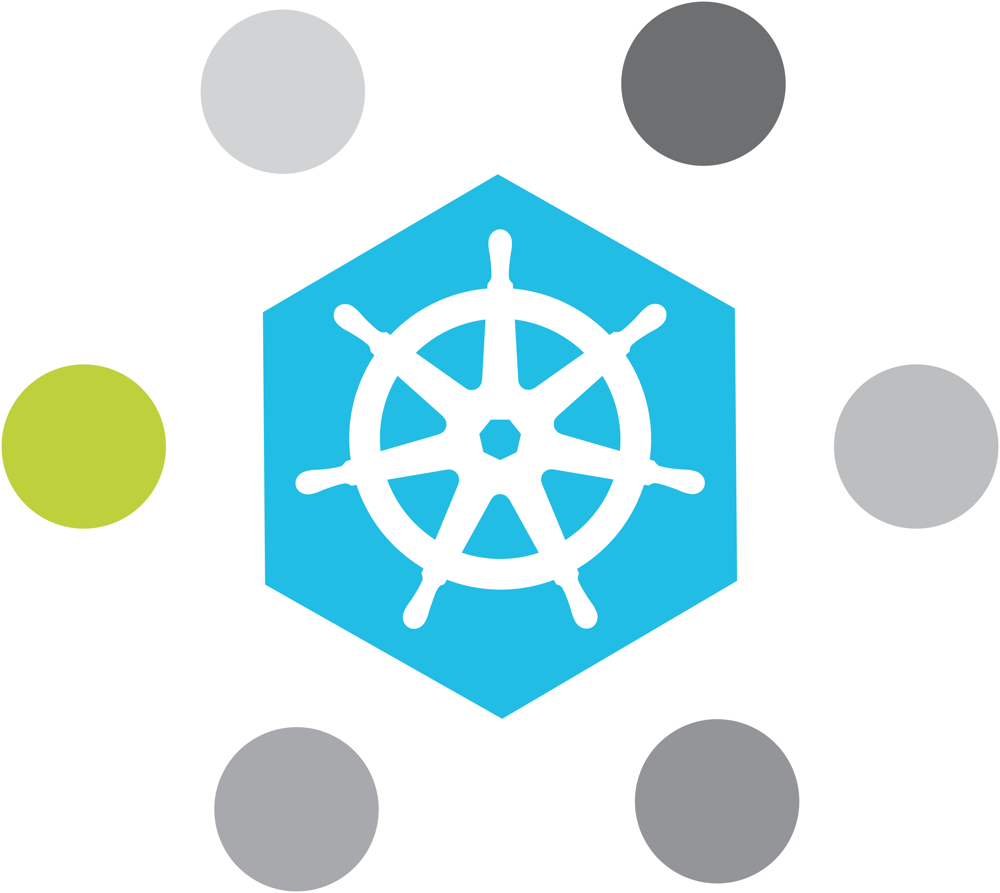

# Kubernetes MidoNet integration

## Introduction

Kubernetes is a Container orchestration engine built in Go that allows you
to deploy your microservices easily and with replication primitives.

MidoNet is a distributed Software Defined Network solution that provides
networking for your whole virtual infrastructure regardless of it being
composed of Virtual Machines, Containers or a mixture of both.

## Components

The integration is based on two components:

* The [CNI driver](cni/README.md) is a component that binds the pods in the
  MidoNet virtual topology.

* The [Raven](raven/README.md) is a Kubernetes API watching daemon that makes
  changes in the MidoNet virtual topology in response to actions performed in
  the Kubernetes API.

## More information

* Contact us via Freenode IRC at #midonet.

