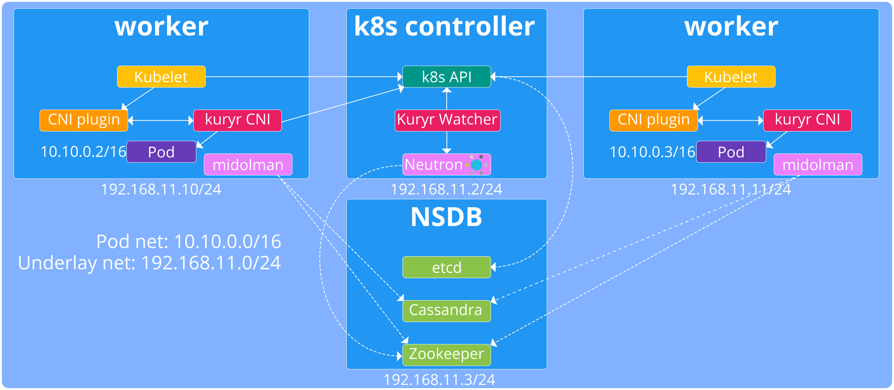

===============================================
Kubernetes MidoNet flat mode integration design
===============================================

This document describes the design choices for MidoNet's integration with
Kubernetes taking the following assumptions:

* Each kubernetes namespace gets a separate /16 overlay network.
* Each /16 network for a namespace is used by any host with Pods in the
  namespace.
* Each tenant can have several namespaces for different services.
* The underlay network is isolated from the overlay networks.
* Services are provided by Neutron Load Balancers. The Load balancers are
  placed on separate subnets on the same namespace network, i.e., each
  namespace has its own load balancer subnet.
* No external load balancers. External access to services via floating IPs.

Kubernetes components overview
-------------------------------

Kubernetes [#]_ is a Container Orchestration engine written in the Go [#]_
programming language. Its architecture is based on an etcd [#]_ backed REST API
server in the controller node and other components that watch the API for
changes and call the API to update the state.

.. image:: https://raw.githubusercontent.com/kubernetes/kubernetes/release-1.1/docs/design/architecture.png
     :align: center
     :alt: Controller and Worker nodes diagram showing the interaction among
           components.

The user interacts with the system via the kubectl cli or directly via REST API
calls. Those calls define Kubernetes resources such as Pods and services. The
replication controller's task is to try make sure that the worker nodes keep at
all time enough copies of a service, either because a specific number was
defined or because the autoscaler policy was triggered. The scheduler sees the
requests for Pods and assigns them to a specific worker node.

On the worker nodes, kubelet daemons see the pods that are being scheduled for
the node on the API watch endpoint and take care of creating the Pods using the
OS facilities.

In the networking reference implementation [#]_, there is another daemon called
kube-proxy that sees the service and pod events and makes sure that requests
for a service find the Pods that serve it.

.. [#] http://kubernetes.io
.. [#] https://golang.org/
.. [#] https://github.com/coreos/etcd
.. [#] https://github.com/kubernetes/kubernetes/blob/release-1.1/docs/design/networking.md

MidoNet integration components overview
----------------------------------------

           components.

The MidoNet integration does away with the kube-proxy services that in the
reference implementation run on each worker node and instead runs the Kuryr
watcher daemon, also known as Raven (The naming comes from the fact that ravens
are creatures that love to watch and observe for the right opportunity and
often do so in groups). Raven is part of the controller node, but it should be
controlled by the replication controller and auto scaled if necessary.

On the worker nodes, the MidoNet integration configures networking to use
kubernetes CNI [#]_ plugin and provide a kuryr CNI driver that will be the one
to plug the Pods into the overlay.

.. [#] https://github.com/appc/cni/blob/master/SPEC.md

Kuryr CNI driver
~~~~~~~~~~~~~~~~~

The Kuryr CNI driver will be an executable that receives parameters [#]_ encoded
in the enviroment variables available to the process. CNI drivers are expected
to return data to its caller, in this case the Kubernetes CNI plugin, by
returning 0 in case of success writing the following to stdout:

.. code-block:: json

    {
       "cniVersion": "0.1.0",
       "ip4": {
         "ip": <ipv4-and-subnet-in-CIDR>,
         "gateway": <ipv4-of-the-gateway>,  (optional)
         "routes": <list-of-ipv4-routes>    (optional)
       },
       "ip6": {
         "ip": <ipv6-and-subnet-in-CIDR>,
         "gateway": <ipv6-of-the-gateway>,  (optional)
         "routes": <list-of-ipv6-routes>    (optional)
       },
       "dns": {
         "nameservers": <list-of-nameservers>           (optional)
         "domain": <name-of-local-domain>               (optional)
         "search": <list-of-additional-search-domains>  (optional)
         "options": <list-of-options>                   (optional)
       }
    }

Clearly in order to be able to configure and report an IP configuration, the
Kuryr CNI driver must be able to access some sort of IPAM. The way in which
this is expected to work is by a very simple algorithm:

1. Does it see the **CNI_ARGS** with not just the standard content::

    CNI_ARGS=K8S_POD_NAMESPACE=default;\
    K8S_POD_NAME=nginx-app-722l8;\
    K8S_POD_INFRA_CONTAINER_ID=8ceb00926acf251b34d70065a6158370953ab909b0745f5f4647ee6b9ec5c250

but also at least the following extra content (check what we pass now to
libnetwork drivers and use that as the minimum set)::

    PORT_UUID=a28c7404-7495-4557-b7fc-3e293508dbc6,\
    IPV4=10.0.0.15/16,\
    GW=10.0.0.1,\
    PORT_TYPE=midonet

2. Use the kuryr-cni username and token to go to the kubernetes API and check
   if the Raven has already populated the annotations with this data. In case
   it is not there, implement a retry with timeout mechanism. For example check
   every half second for 10 seconds. If the data is not there, exit with an
   error return code (We should keep a nice behavior and return different
   values for different kinds of errors.

Once it has the right data (as seen in the parameters passed to
processutils.execute in [#]_ ), it will provide it to the already existing
kuryr libnetwork binding scripts (that should be packaged without dependencies
to the kuryr libnetwork package) found under::

    /usr/libexec/kuryr

The credentials to access the configuration can either be lifted from those of
kubelet or, rather, we should put them at::

    /usr/libexec/kubernetes/kubelet-plugins/net/exec/10-kuryr.conf

The content should be something like the following

.. code-block:: json

    {
      "name": "kuryr-network",
      "type": "kuryr",
      "api_token": "asdfl;kads34uio"
    }

The CNI driver is a python based executable that lives in::

    /usr/libexec/kubernetes/kubelet-plugins/net/exec/kuryr

Kubelet should be configured to use the Kuryr CNI driver by modifying its
service file appending the to ExecStart::

    --network-plugin=cni

.. [#] https://github.com/appc/cni/blob/master/SPEC.md#parameters
.. [#] https://github.com/openstack/kuryr/blob/master/kuryr/binding.py

Kuryr API watcher (Raven)
~~~~~~~~~~~~~~~~~~~~~~~~~~

The Kubernetes API server provides watch interfaces against each kind of
resource it provides [#]_. In order to *subscribe* to the feed of events for a
specific resource you have to add to the query string::

    ?watch=true

If we wanted to watch the **pod** events, we would need to do a **GET HTTP**
request for the following URL::

    /api/v1//pods?watch=true

The kind of events that are received on Pod creation are:

.. code-block:: json

    {
      "type": "ADDED",
      "object": {
        "kind": "Pod",
        "apiVersion": "v1",
        "metadata": {
          "name": "nginx-app-v87k2",
          "generateName": "nginx-app-",
          "namespace": "default",
          "selfLink": "\/api\/v1\/namespaces\/default\/pods\/nginx-app-v87k2",
          "uid": "8cca008f-d492-11e5-bf9e-42010af00005",
          "resourceVersion": "150",
          "creationTimestamp": "2016-02-16T09:49:19Z",
          "labels": {
            "run": "nginx-app"
          },
          "annotations": {
            "kubernetes.io\/created-by": "{\"kind\":\"SerializedReference\",\"apiVersion\":\"v1\",\"reference\":{\"kind\":\"ReplicationController\",\"namespace\":\"default\",\"name\":\"nginx-app\",\"uid\":\"8cbeff3d-d492-11e5-bf9e-42010af00005\",\"apiVersion\":\"v1\",\"resourceVersion\":\"135\"}}\n"
          }
        },
        "spec": {
          "volumes": [
            {
              "name": "default-token-rzpa9",
              "secret": {
                "secretName": "default-token-rzpa9"
              }
            }
          ],
          "containers": [
            {
              "name": "nginx-app",
              "image": "nginx",
              "ports": [
                {
                  "containerPort": 80,
                  "protocol": "TCP"
                }
              ],
              "env": [
                {
                  "name": "DOMAIN",
                  "value": "cluster"
                }
              ],
              "resources": {

              },
              "volumeMounts": [
                {
                  "name": "default-token-rzpa9",
                  "readOnly": true,
                  "mountPath": "\/var\/run\/secrets\/kubernetes.io\/serviceaccount"
                }
              ],
              "terminationMessagePath": "\/dev\/termination-log",
              "imagePullPolicy": "IfNotPresent"
            }
          ],
          "restartPolicy": "Always",
          "terminationGracePeriodSeconds": 30,
          "dnsPolicy": "ClusterFirst",
          "serviceAccountName": "default",
          "serviceAccount": "default",
          "nodeName": "127.0.0.1"
        },
        "status": {
          "phase": "Running",
          "conditions": [
            {
              "type": "Ready",
              "status": "True",
              "lastProbeTime": null,
              "lastTransitionTime": null
            }
          ],
          "hostIP": "127.0.0.1",
          "podIP": "172.17.0.2",
          "startTime": "2016-02-16T09:49:19Z",
          "containerStatuses": [
            {
              "name": "nginx-app",
              "state": {
                "running": {
                  "startedAt": "2016-02-16T09:49:20Z"
                }
              },
              "lastState": {

              },
              "ready": true,
              "restartCount": 0,
              "image": "nginx",
              "imageID": "docker:\/\/sha256:69203b7cd029af1b6ae717904b64cf4ba4b32be3f99d18420b2ac9c33423d671",
              "containerID": "docker:\/\/33512d6bd94a6d7d1b3f8b65441e29390636660bb82544383fa3a0309c41430d"
            }
          ]
        }
      }
    }

Raven would then, of course, have to use the Python neutron client [#]_ to
create a neutron port on the flat network.

Raven startup will have to:
* Load the configuration from::

    /etc/kuryr/raven.conf.

* Check that the default namespace network exists and create it otherwise,
* Check that the VIP network exists and create it otherwise.
* Check that the configured VIP public network exists and abort otherwise,
* Check that the namespace, vip and public networks all have interfaces with

For services, the endpoint to watch would be::

    /api/v1/services?watch=true

The kind of events that would be received would be as follows:

.. code-block:: json

    {
       "type":"ADDED",
       "object":{
          "kind":"Service",
          "apiVersion":"v1",
          "metadata":{
             "name":"redis-slave",
             "namespace":"default",
             "selfLink":"/api/v1/namespaces/default/services/redis-slave",
             "uid":"7b0b6fe8-d54c-11e5-8cc5-42010af00002",
             "resourceVersion":"2077",
             "creationTimestamp":"2016-02-17T08:00:16Z",
             "labels":{
                "app":"redis",
                "role":"slave",
                "tier":"backend"
             }
          },
          "spec":{
             "ports":[
                {
                   "protocol":"TCP",
                   "port":6379,
                   "targetPort":6379
                }
             ],
             "selector":{
                "app":"redis",
                "role":"slave",
                "tier":"backend"
             },
             "clusterIP":"10.0.0.254",
             "type":"ClusterIP",
             "sessionAffinity":"None"
          },
          "status":{
             "loadBalancer":{

             }
          }
       }
    }

The MidoNet integration services are backed by Neutron Load Balancers. As such,
we would collect the above information to configure the service Load Balancer:

* **clusterIP**: This would be used as VIP. The VIPs live in a separate network
  under the same router that serves the flat overlay network.
* **protocol**: This will be the LB protocol.
* **port**: This will be the LB port.
* **selector**: This will be used in Pod addition to add members to the service
  LB.

To give external access to a service, the service event data requested should
contain "LoadBalancer" and that will trigger assigning a FIP to the VIP. The
event would look as follows:

.. code-block:: json

    {
        "kind": "Service",
        "apiVersion": "v1",
        "metadata": {
            "name": "my-service"
        },
        "spec": {
            "selector": {
                "app": "MyApp"
            },
            "ports": [
                {
                    "protocol": "TCP",
                    "port": 80,
                    "targetPort": 9376,
                    "nodePort": 30061
                }
            ],
            "clusterIP": "10.0.171.239",
            "loadBalancerIP": "78.11.24.19",
            "type": "LoadBalancer"
        },
        "status": {
            "loadBalancer": {
                "ingress": [
                    {
                        "ip": "146.148.47.155"
                    }
                ]
            }
        }
    }

Note the presence of **loadBalancerIP** and **type**. The FIP will be created,
associated with the VIP and the status **loadBalancer** updated in the
kubernetes API service endpoint.

.. [#] http://kubernetes.io/v1.1/docs/api.html
.. [#] https://github.com/openstack/python-neutronclient
